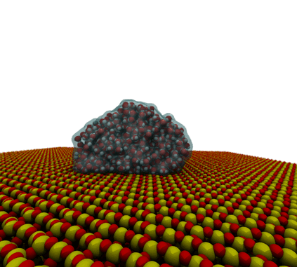

# Case 2 Tutorial: Water Droplet on a Silica Q4 Surface 

This tutorial provides a step-by-step guide for converting and simulating a Silica Q4 surface using [INTERFACE-FF](https://bionanostructures.com/interface-md/). The current folder (`case2_files`) contains these necessary files:
- This README guide.
- LAMMPS data files for Silica Q4 and a LAMMPS input script to replicate the cell.
- TIP4P/2005 water parameter files.
- GROMACS parameter files (.mdp) for energy minimization and NVT ensembles.

---

### INTERFACE-FF Pre-processing Notes

The LAMMPS data files for silica Q4 were generated using `msi2lmp` (distributed by the Heinz Team). To replicate the generation process:

Download the INTERFACE folder from the [official website](https://bionanostructures.com/interface-md/). The following files are required for `msi2lmp`:
1. `INTERFACE_FF_1_5/FORCE_FIELDS/cvff_interface_v1_5.frc` (Note: Use the CVFF format for compatibility with `lmp2gro`).
2. `INTERFACE_FF_1_5/MODEL_DATABASE/SILICA/silica_Q4_0_0OH.car`
3. `INTERFACE_FF_1_5/MODEL_DATABASE/SILICA/silica_Q4_0_0OH.mdf`

You will also need the `msi2lmp` executable. You can find it in the `UTILITY_PROGRAMS` folder of INTERFACE-FF or the `tools/msi2lmp` directory of the [LAMMPS source](https://www.lammps.org/download.html). On Linux, compile it by running `make` inside the `src` folder.

Once you have the `msi2lmp` executable and the INTERFACE files in the same directory, run:

```bash
./msi2lmp.exe silica_Q4_0_0OH -class I -f ./cvff_interface_v1_5.frc
```

This generates `silica_Q4_0_0OH.data` (a copy is already provided in `case2_files`).

---

### Replicating Data Files

To compute the contact angle of water, we need to replicate the structure in the X-direction. This is achieved using the `in.replicate` LAMMPS script:

```bash
lmp < in.replicate
```

The output file is `replicated_Q4.data`. Both the input and output are available in the `case2_files` folder.

---

## Step 1 - Utilizing lmp2gro

Generate the GROMACS topology and structural files from the replicated data file:

```bash
python3 lmp2gro.py case2_files/replicated_Q4.data -r QTZ --folder case2
```

*Note: This system contains a large number of atoms and may take a moment to process—good time for a coffee break!*

The command generates: `atomtypes.itp`, `conf.gro`, `conf.itp`, `ffbonded.itp`, and `topol.top`.

**Manual Topology Adjustment:** Open `topol.top` and insert a semicolon (`;`) at the start of line 9 to comment out the `case1` default settings. Then, navigate into the case2 directory.

## Step 2 - Initial Energy Minimization (EM)

Prepare the binary run input (`.tpr`) using the `em.mdp` file from `case2_files`:

```bash
gmx grompp -f em.mdp -c conf.gro -p topol.top -o em.tpr -maxwarn 3
```

Execute the minimization:

```bash
gmx mdrun -v -s em.tpr -deffnm em_out
```

## Step 3 - Water Droplet Configuration

We will now integrate the TIP4P/2005 water model ([Madrid Force Field](https://doi.org/10.1063/1.5121392)). 

1. **Add Atom Types:** Append the following parameters to the end of your `atomtypes.itp` file:

```text
; TIP4P/2005 and Ions from https://doi.org/10.1063/1.5121392
HW_tip42005   1       1.008   0.0000  A   0.00000e+00  0.00000e+00
OW_tip42005   8      16.00    0.0000  A   3.1589e-01   7.74908e-01
V_Na     22.9898       0.850       A   0.22173668    1.47235577
V_Mg     24.305        1.700       A   0.11629000    3.65190000
V_Ca     40.078        1.700       A   0.26656000    0.50720000
V_K      39.0983       0.850       A   0.23014000    1.98574000
V_Li     6.94100       0.850       A   0.14397000    0.43508986
V_Cl     35.4530      -0.850       A   0.46990563    0.07692308
V_OSO4   24.01565     -0.650       A   0.36500000    0.83740000
V_SSO4   0             0.900       D   0.35500000    1.04670000
V_IW     0             0.000       D   0.00000000    0.00000000
V_OWT4   15.9994       0.000       A   0.31589000    0.77490765
V_HW     1.00794       0.000       A   0.00000000    0.00000000
```

2. **Update Topology Includes:** Modify the `#include` section in `topol.top` to:

```text
#include "atomtypes.itp"
#include "vega_nonbonded_par.itp"
#include "ffbonded.itp"
#include "conf.itp"
#include "vega_ions.itp"
```

3. **Copy Dependencies:** Ensure `vega_nonbonded_par.itp` and `vega_ions.itp` from `case2_files` are in your working directory.

4. **Register Molecules:** Append `water 1300` to the `[ molecules ]` section in `topol.top`.

## Step 4 - Molecular Insertion and Box Scaling

Open `em_out.gro` and locate the box dimensions in the final line (e.g., `23.35725 3.48420 6.68584`). We will increase the Z-dimension to create a vacuum slab (e.g., `100.00000`).

We use [Packmol](https://m3g.github.io/packmol/) to position the water droplet. Run the following inside the `case2_files` directory:

```bash
packmol < packmol.inp
gmx editconf -f water_box.pdb -o water_box.gro
```

To merge the water with the surface, copy the coordinate lines from `water_box.gro` and paste them at the end of `em_out.gro` (before the box dimensions). Update the atom count at the top of the file. To verify and clean the file, run:

```bash
gmx editconf -f em_out.gro -o qtz_water.gro
```

There is a final version of `qtz_water.gro` inside the `case2_files` directory, if needed.

## Step 5 - Index Generation and Constraints

To maintain the structural integrity of the substrate and prevent the surface from drifting, we must freeze the bottom layer of the quartz. This requires creating a specific index group.

1. **Generate a Reference TPR:**
To use selection tools, we first need a binary topology file (.tpr). Run `grompp` using your initial configuration:

```bash
gmx grompp -f em.mdp -c qtz_water.gro -p topol.top -o initial.tpr -maxwarn 3
```

2. **Generate the Base Index File:**
Create a standard index file containing the default groups (System, Quartz, Water, etc.):

```bash
gmx make_ndx -f initial.tpr -o index.ndx
```
*(Type 'q' to save and exit).*

3. **Select the Bottom Atoms (Z < 1 nm):**
Use the `gmx select` tool to identify all atoms in the lower 1 nm of the box. This creates a temporary index file:

```bash
gmx select -f qtz_water.gro -s initial.tpr -select 'z < 1' -on bottom_part.ndx
```

4. **Merge and Rename the Groups:**
Now, merge the new selection into your main index file and rename it for clarity.

*On Linux:*
```bash
cat index.ndx bottom_part.ndx > final_index.ndx
```

Then, open the index with `make_ndx` to finalize the naming:
```bash
gmx make_ndx -f initial.tpr -n final_index.ndx
```
* In the `make_ndx` prompt, identify the number of the newly added group (usually at the end).
* Type `name X bottom_part` (replace `X` with the group number).
* Type `q` to save as `index.ndx`.

## Step 6 - Constrained Energy Minimization

Using `em_freeze.mdp` from `case2_files`:

```bash
gmx grompp -f em_freeze.mdp -c qtz_water.gro -p topol.top -n index.ndx -o em_freezed.tpr -maxwarn 3
gmx mdrun -v -s em_freezed.tpr -deffnm em_system_out
```

## Step 7 - NVT Production Run

Finally, run the NVT simulation using `nvt_freeze.mdp`:

```bash
gmx grompp -f nvt_freeze.mdp -c em_system_out.gro -p topol.top -n index.ndx -o nvt_freezed.tpr -maxwarn 3
gmx mdrun -v -s nvt_freezed.tpr -deffnm nvt_system_out
```

## Simulation Results
Here is a trajectory animation of the NVT production run:

<p align="center">
  
</p>
